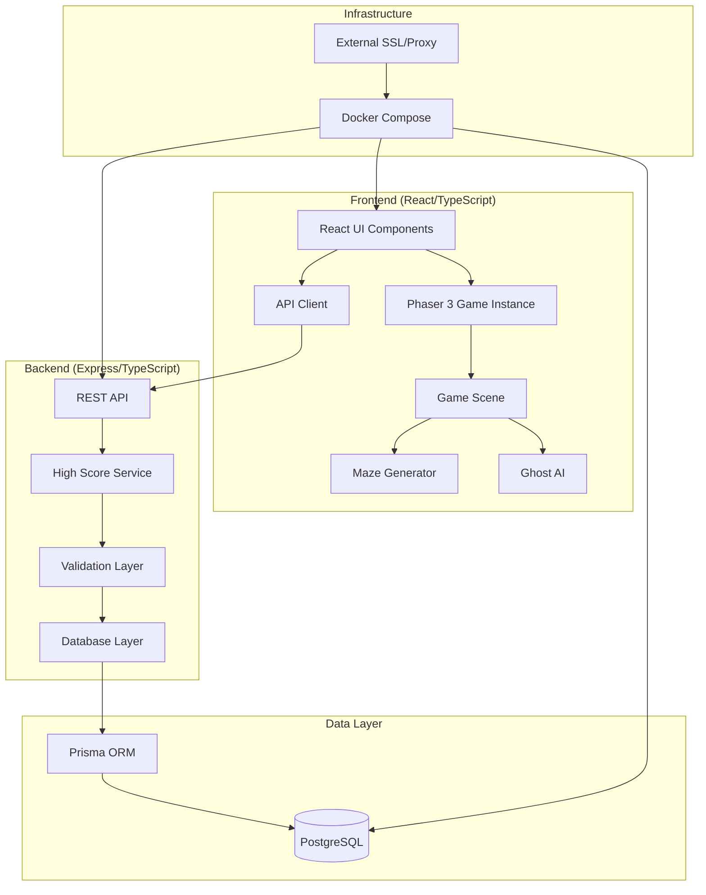

# Pacman Game Design Document

## Overview

The Pacman Game is a modern web-based recreation of the classic arcade game, built with React/TypeScript frontend using Phaser 3 game engine and Express/TypeScript backend. The system features procedurally generated mazes, responsive pixel art graphics, classic sound effects, and a persistent high score system. Phaser 3 provides the canvas-based rendering, sprite management, input handling, and audio systems, while React manages the UI shell and game lifecycle. The architecture emphasizes modularity, performance, and authentic gameplay mechanics while supporting modern deployment practices.

## Architecture

### System Architecture



### Component Interaction Flow

1. **React Integration**: React component mounts Phaser 3 game instance into a canvas container
2. **Input Processing**: Phaser's input system captures keyboard/touch events and queues movement commands
3. **Game Logic**: Game Scene (Phaser Scene) processes commands, updates game state, handles collisions
4. **Rendering**: Phaser's WebGL/Canvas renderer draws sprites and tilemaps with pixel art assets
5. **Animation**: Phaser's animation system manages sprite animations and smooth movement transitions
6. **Audio**: Phaser's sound manager plays sound effects synchronized with game events
7. **Persistence**: React API Client communicates with backend for high score operations
8. **UI Overlay**: React components render game UI (score, lives, high score table) over Phaser canvas

## Components and Interfaces

### Frontend Components

#### Phaser Game Configuration (`PhaserGame.tsx`)
```typescript
interface PhaserGameConfig {
  type: Phaser.AUTO; // WebGL with Canvas fallback
  width: number;
  height: number;
  parent: string;
  physics: {
    default: 'arcade';
    arcade: {
      debug: boolean;
    };
  };
  scene: [GameScene];
  scale: {
    mode: Phaser.Scale.FIT;
    autoCenter: Phaser.Scale.CENTER_BOTH;
  };
}
```

#### Game Scene (`GameScene.ts`)
```typescript
class GameScene extends Phaser.Scene {
  player: Phaser.Physics.Arcade.Sprite;
  ghosts: Phaser.Physics.Arcade.Group;
  dots: Phaser.Physics.Arcade.StaticGroup;
  powerPellets: Phaser.Physics.Arcade.StaticGroup;
  maze: Phaser.Tilemaps.Tilemap;
  
  create(): void;
  update(time: number, delta: number): void;
  handleInput(): void;
  checkCollisions(): void;
  advanceLevel(): void;
  endGame(): void;
}

interface GameState {
  score: number;
  lives: number;
  level: number;
  powerMode: boolean;
  powerModeTimer: number;
  gameStatus: 'playing' | 'paused' | 'gameOver';
}
```

#### Maze Generator (`MazeGenerator.ts`)
```typescript
interface MazeGenerator {
  generateMaze(level: number): MazeData;
  validateMaze(maze: MazeData): boolean;
  placeDots(maze: MazeData): void;
  createTunnels(maze: MazeData): void;
}

interface MazeData {
  width: number;
  height: number;
  walls: boolean[][];
  dots: boolean[][];
  powerPellets: Position[];
  tunnels: TunnelPair[];
  ghostSpawn: Position;
  playerSpawn: Position;
}
```

#### Sprite and Animation Management
```typescript
// Phaser handles sprite loading and animation
class GameScene extends Phaser.Scene {
  preload(): void {
    // Load sprite sheets
    this.load.spritesheet('pacman', 'assets/pacman.png', {
      frameWidth: 16,
      frameHeight: 16
    });
    this.load.spritesheet('ghosts', 'assets/ghosts.png', {
      frameWidth: 16,
      frameHeight: 16
    });
    this.load.image('tiles', 'assets/maze-tiles.png');
    
    // Load audio
    this.load.audio('chomp', 'assets/sounds/chomp.wav');
    this.load.audio('death', 'assets/sounds/death.wav');
    this.load.audio('eatGhost', 'assets/sounds/eat-ghost.wav');
  }
  
  createAnimations(): void {
    this.anims.create({
      key: 'pacman-move',
      frames: this.anims.generateFrameNumbers('pacman', { start: 0, end: 3 }),
      frameRate: 10,
      repeat: -1
    });
  }
}
```

#### Input Handling (Phaser Built-in)
```typescript
class GameScene extends Phaser.Scene {
  cursors: Phaser.Types.Input.Keyboard.CursorKeys;
  wasd: { W: Phaser.Input.Keyboard.Key; A: Phaser.Input.Keyboard.Key; S: Phaser.Input.Keyboard.Key; D: Phaser.Input.Keyboard.Key };
  
  create(): void {
    // Keyboard input
    this.cursors = this.input.keyboard.createCursorKeys();
    this.wasd = this.input.keyboard.addKeys('W,A,S,D') as any;
    
    // Touch input
    this.input.on('pointerdown', this.handleTouch, this);
  }
  
  handleTouch(pointer: Phaser.Input.Pointer): void {
    // Calculate swipe direction from touch
  }
}
```

### Backend Components

#### High Score API (`highScoreController.ts`)
```typescript
interface HighScoreController {
  getHighScores(): Promise<HighScore[]>;
  submitScore(scoreData: ScoreSubmission): Promise<HighScore>;
  validateAcronym(acronym: string): boolean;
}

interface HighScore {
  id: string;
  acronym: string;
  score: number;
  createdAt: Date;
  rank: number;
}
```

#### Database Schema (Prisma)
```prisma
model HighScore {
  id        String   @id @default(cuid())
  acronym   String   @db.VarChar(3)
  score     Int
  createdAt DateTime @default(now())
  
  @@map("high_scores")
}
```

## Data Models

### Core Game Models

#### Player State
```typescript
interface PlayerState {
  position: Position;
  direction: Direction;
  nextDirection: Direction | null;
  speed: number;
  animationFrame: number;
  isAlive: boolean;
}
```

#### Ghost State
```typescript
interface GhostState {
  id: string;
  position: Position;
  direction: Direction;
  mode: 'chase' | 'scatter' | 'frightened' | 'eaten';
  speed: number;
  color: GhostColor;
  target: Position;
  pathfinding: PathNode[];
}
```

#### Animation Models
```typescript
interface AnimationFrame {
  spriteX: number;
  spriteY: number;
  duration: number;
}

interface AnimationSequence {
  frames: AnimationFrame[];
  loop: boolean;
  currentFrame: number;
}
```

### API Models

#### Score Submission
```typescript
interface ScoreSubmission {
  acronym: string;
  score: number;
  level: number;
  timestamp: Date;
}
```

#### API Response
```typescript
interface ApiResponse<T> {
  success: boolean;
  data?: T;
  error?: string;
  timestamp: Date;
}
```

## Correctness Properties

*A property is a characteristic or behavior that should hold true across all valid executions of a system-essentially, a formal statement about what the system should do. Properties serve as the bridge between human-readable specifications and machine-verifiable correctness guarantees.*

### Property 1: Input Processing Consistency
*For any* valid input command (keyboard or touch), processing the input should result in either immediate direction change or proper queuing for execution at the next valid intersection, without losing or duplicating commands.
**Validates: Requirements 1.1, 1.2, 1.5**

### Property 2: Wall Collision Prevention
*For any* player position and movement direction, attempting to move into a wall should prevent movement and maintain the current position without state corruption.
**Validates: Requirements 1.3**

### Property 3: Score Calculation Accuracy
*For any* sequence of game events (dot collection, ghost consumption, power pellet activation), the final score should equal the sum of individual event scores according to classic Pacman scoring rules.
**Validates: Requirements 2.1, 2.4**

### Property 4: Power Mode Consistency
*For any* power pellet consumption, the game should enter power mode for exactly 10 seconds, make all ghosts vulnerable, and restore normal mode afterward.
**Validates: Requirements 2.2**

### Property 5: Life Management Accuracy
*For any* ghost collision in normal mode, lives should decrease by exactly one, positions should reset correctly, and game should end when lives reach zero.
**Validates: Requirements 2.3, 7.2, 7.3**

### Property 6: Level Progression Logic
*For any* maze configuration, collecting all dots should advance to the next level with properly generated maze and increased difficulty parameters.
**Validates: Requirements 2.5, 3.3**

### Property 7: Maze Generation Validity
*For any* generated maze at any level, all areas should be reachable from the player spawn point, exactly two tunnel exits should exist on opposite sides, and dot placement should maintain consistent density.
**Validates: Requirements 3.1, 3.2, 3.4, 3.5**

### Property 8: Responsive Scaling Preservation
*For any* screen resolution and viewport change, the game should scale proportionally while maintaining pixel art clarity and proper touch control positioning.
**Validates: Requirements 4.1, 4.3, 4.5**

### Property 9: Animation Frame Consistency
*For any* sprite animation sequence, frame timing should remain consistent with classic arcade game standards and loop properly.
**Validates: Requirements 4.4**

### Property 10: Audio Event Synchronization
*For any* game event that triggers sound effects, audio should play at correct timing intervals without inappropriate overlap or missing sounds.
**Validates: Requirements 5.1, 5.2, 5.3, 5.4, 5.5**

### Property 11: High Score Validation and Storage
*For any* valid acronym input (3 alphabetic characters), the system should store the score with timestamp and retrieve it in properly sorted order.
**Validates: Requirements 6.1, 6.2, 6.3, 6.4, 6.5**

### Property 12: Game Initialization Consistency
*For any* game start, the player should initialize with exactly 3 lives and proper starting positions.
**Validates: Requirements 7.1**

### Property 13: Database Connection Reliability
*For any* backend startup, database connectivity and schema validation should complete successfully before accepting requests.
**Validates: Requirements 8.2, 8.4, 9.4**

### Property 14: API Error Handling Robustness
*For any* invalid input or database failure, the API should return appropriate error responses with proper HTTP status codes and meaningful messages.
**Validates: Requirements 9.1, 9.2, 9.3**

### Property 15: Concurrent Request Safety
*For any* concurrent high score submissions, data consistency should be maintained without race conditions or lost updates.
**Validates: Requirements 9.5**

## Error Handling

### Frontend Error Handling

#### Game Engine Errors
- **Invalid State Transitions**: Log error and reset to last valid state
- **Collision Detection Failures**: Fallback to bounding box collision
- **Animation Frame Drops**: Skip frames to maintain game timing
- **Audio Loading Failures**: Continue game without sound effects

#### Network Errors
- **API Connection Failures**: Cache scores locally and retry submission
- **Timeout Handling**: Display user-friendly error messages
- **Invalid Response Data**: Validate and sanitize all API responses

### Backend Error Handling

#### Database Errors
- **Connection Failures**: Implement connection pooling and retry logic
- **Query Timeouts**: Set appropriate timeout limits and error responses
- **Data Validation Errors**: Return specific validation error messages
- **Concurrent Access**: Use database transactions for consistency

#### API Error Responses
```typescript
interface ErrorResponse {
  error: {
    code: string;
    message: string;
    details?: any;
  };
  timestamp: Date;
  requestId: string;
}
```

## Testing Strategy

### Unit Testing Approach
The system will use Jest for unit testing with the following focus areas:
- **Game Logic Functions**: Test individual game mechanics like scoring, collision detection, and state transitions
- **Utility Functions**: Test maze generation algorithms, input validation, and data transformation
- **API Endpoints**: Test REST API responses, error handling, and data validation
- **Component Integration**: Test React component rendering and event handling

### Property-Based Testing Approach
The system will use fast-check for property-based testing with a minimum of 100 iterations per property:
- **Game State Properties**: Verify game state consistency across random input sequences
- **Maze Generation Properties**: Test maze validity across different level parameters
- **Score Calculation Properties**: Verify scoring accuracy across random game event sequences
- **Input Processing Properties**: Test input handling across various timing and sequence scenarios

Each property-based test will be tagged with comments explicitly referencing the correctness property from this design document using the format: '**Feature: pacman-game, Property {number}: {property_text}**'

### Integration Testing
- **End-to-End Game Flow**: Test complete game sessions from start to high score submission
- **API Integration**: Test frontend-backend communication and data persistence
- **Cross-Browser Compatibility**: Test game functionality across different browsers and devices
- **Performance Testing**: Verify frame rate consistency and memory usage under load

### Testing Libraries and Tools
- **Frontend**: Jest, React Testing Library, fast-check for property-based testing
- **Phaser Testing**: Jest with Phaser headless mode for game logic testing
- **Backend**: Jest, Supertest for API testing, fast-check for data validation properties
- **Database**: Jest with test database containers for isolation
- **E2E**: Playwright for cross-browser end-to-end testing

### Technology Stack Summary

**Frontend:**
- React 18+ with TypeScript
- Phaser 3 (latest stable) for game engine
- Axios for API communication
- CSS Modules or Styled Components for UI styling

**Backend:**
- Node.js with Express
- TypeScript
- Prisma ORM
- PostgreSQL 14+

**DevOps:**
- Docker & Docker Compose
- Nginx (external SSL termination)
- Environment-based configuration

**Testing:**
- Jest for unit and integration tests
- fast-check for property-based testing
- Playwright for E2E tests
- React Testing Library for component tests